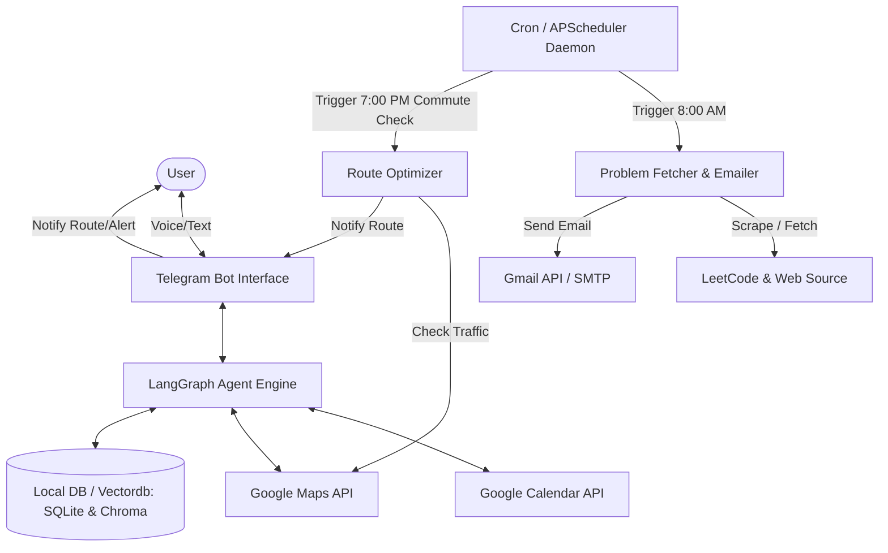
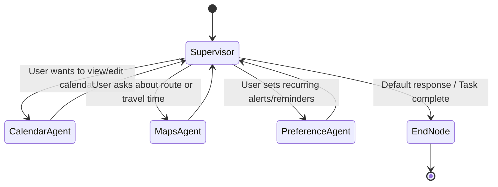

# Personal Day Planner Assistant: System Architecture

This architecture document outlines the design, component structure, and workflow for a **LangGraph-powered Personal Assistant** that automates daily planning, integrates with **Google Calendar** and **Google Maps**, fetches and schedules daily technical problems (LeetCode DSA & System Design), and analyzes user habits to suggest optimal commute routes.

---

## 1. System Overview & Core Capabilities

The assistant functions as an autonomous agent that handles both **reactive** requests (answering user queries, scheduling events) and **proactive** notifications (sending daily problem sets at 8:00 AM, suggesting commute routes at 7:00 PM based on learned behavior).



---

## 2. Multi-Agent System Architecture (LangGraph)

The assistant uses **LangGraph** to model the conversation flow and task execution as a state machine. It is designed as a **Supervisor Router** that delegates requests to specialized sub-agents based on the user's intent.

### A. Graph State Definition

The shared state tracks the conversation history, parsed requirements, scheduling directives, and temporal context.

```python
from typing import Annotated, TypedDict, List
from langchain_core.messages import BaseMessage
from langgraph.graph.message import add_messages

class AssistantState(TypedDict):
    messages: Annotated[List[BaseMessage], add_messages]
    user_location: str             # Current location for maps queries
    home_address: str              # Saved home address
    work_address: str              # Saved work address
    scheduled_tasks: List[dict]    # Active daily crons/tasks
    calendar_events: List[dict]    # Cached events for planning
    user_commute_patterns: List[dict] # Commute log for pattern analysis
```

### B. Node Structure & Agent Routing

The LangGraph consists of the following nodes:



1. **Supervisor Router**: Uses a lightweight LLM (e.g., `gemini-2.5-flash`) to parse user commands and determine which specialized node or tool to invoke.
2. **Calendar Agent**: A specialized node with access to Google Calendar API tools (read, write, delete, search events).
3. **Maps Agent**: A specialized node with access to Google Maps API tools (get travel duration, routing directions, traffic updates).
4. **Preference/Reminder Agent**: Stores user configuration (e.g., "Email me problems at 8:00 AM", "Home address is X"). It saves these values to a persistent local SQLite database.

---

## 3. Core Component Integrations

### A. Google Calendar Integration
- **OAuth2 Authentication**: Secure user authentication using Google OAuth consent screen, storing credentials locally in `credentials.json` and refreshing via `token.json`.
- **Calendar Tools**:
  - `list_events_tool(start_time, end_time)`: Fetches user calendar to audit free blocks.
  - `create_event_tool(summary, start_time, duration_minutes, description)`: Schedules tasks and breaks.
  - `find_free_slots(duration_minutes)`: Scans the daily schedule to suggest when to solve the LeetCode problems.

### B. Google Maps Integration
- **Directions API**: Retrieves directions and transit modes.
- **Distance Matrix API**: Used to query duration-in-traffic predictions.
- **Commute Alert Tool**: Computes the travel duration from `work_address` to `home_address` at specific departure times.

### C. Problem Fetcher & Emailer (LeetCode & System Design)
1. **DSA Fetcher**: Queries the unofficial LeetCode GraphQL API to pull 2 random questions matching user-defined difficulty (e.g., Medium/Hard).
2. **System Design Fetcher**: Scrapes articles from reliable engineering blogs (e.g., ByteByteGo, InfoQ, Netflix Tech Blog) or queries a curated list stored in the local SQLite database.
3. **Email Agent**: Formats the problems as a beautiful HTML newsletter and sends it to the user's email via the Gmail API or secure SMTP.

### D. Telegram Bot Interface
1. **Async Telegram Client**: Powered by `python-telegram-bot`. Configured to poll for updates or listen on webhooks. It serves as the primary conversational interface.
2. **Text Processing**: Standard text messages are wrapped as `HumanMessage` objects and fed into the LangGraph orchestrator.
3. **Push Notifications**: In addition to email digests, the Telegram Bot API is used to push real-time alerts directly to the user's chat (e.g., commute traffic updates at 7:00 PM or calendar reminders).

---

## 4. Automation & Habit Analysis System

A key feature is the ability to schedule daily tasks and discover commute patterns.

### A. Scheduler Engine (proactive triggers)
We use `APScheduler` (Advanced Python Scheduler) running in a background thread or a standalone process.
- **Daily 8:00 AM Cron**: Triggers the `ProblemFetcherAgent` to fetch LeetCode & System Design questions, and hands them to the `EmailAgent` to send out the daily digest.
- **Pattern Tracker Hook**: Every time the user interacts with the system or departs their workspace, the location and timestamp are recorded in a local SQLite table `commute_logs`.
- **Daily Commute Check (e.g., 7:00 PM)**: A cron job runs daily at 7:00 PM. It reads the pattern database. If the user's logs indicate they consistently depart work around this hour, the scheduler fires a Maps query to evaluate traffic home and proactively pushes the fastest route via SMS (Twilio) or notification.

### B. Commute Pattern Inference Logic
The `PatternAnalyzer` component runs a periodic batch script (e.g., every Sunday night) that analyzes the last 14 days of commute logs:
1. **Data Collection**: Collects `(departure_timestamp, location_source, location_destination)`.
2. **Cluster Detection**: Identifies departure time clusters (e.g., standard deviation of departure times is within 30 minutes of 7:00 PM).
3. **Dynamic Rule Creation**: If a pattern is detected (e.g., "Leaves work at 7:00 PM on weekdays"), it registers a new conditional trigger in the Scheduler:
   - *Trigger*: Weekdays at 6:45 PM.
   - *Action*: Query Google Maps Distance Matrix API and notify: *"Traffic is heavy on route A. Take route B instead to save 12 minutes."*

---

## 5. Local Directory Structure

Here is the proposed structure for the `/Users/Aditya/Desktop/Assisteasy` project:

```text
Assisteasy/
├── config/
│   ├── settings.py           # Database paths, API keys, email & Telegram credentials
│   ├── token.json            # Google API OAuth tokens (runtime generated)
│   └── credentials.json      # Google Cloud App credentials
├── database/
│   ├── schema.sql            # SQLite schema for user preferences, logs, patterns
│   └── db_manager.py         # DB read/write helper functions
├── src/
│   ├── __init__.py
│   ├── agent.py              # LangGraph compilation (Nodes, Edges, State)
│   ├── scheduler.py          # APScheduler cron configuration
│   ├── interface/
│   │   ├── __init__.py
│   │   └── telegram.py       # Telegram bot event handlers (text, push)
│   ├── tools/
│   │   ├── __init__.py
│   │   ├── calendar_tools.py # Google Calendar API integrations
│   │   ├── maps_tools.py     # Google Maps API integrations
│   │   └── email_tools.py    # Gmail API / SMTP mailing helpers
│   └── scrapers/
│       ├── __init__.py
│       ├── leetcode.py       # Leetcode GraphQL / scraper client
│       └── system_design.py  # System design article aggregator
├── main.py                   # Main bot execution entrypoint & daemon
├── requirements.txt          # Python dependencies
└── architecture.md           # This architecture overview
```

---

## 6. Technology Stack

- **Framework**: Python 3.11+, LangGraph, LangChain.
- **LLM Engine**: Gemini API (`gemini-2.5-flash` for agent reasoning; cost-efficient, fast tool-calling).
- **Interface**: `python-telegram-bot` (asynchronous library for bot interaction).
- **Scheduler**: `APScheduler` (sqlite store for persistence across restarts).
- **Database**: `SQLite3` (lightweight, zero-config, highly portable) + `SQLAlchemy` ORM.
- **Integrations**:
  - `google-api-python-client` & `google-auth-oauthlib` (Google Workspace / Calendar / Gmail APIs).
  - `googlemaps` client library.
  - `requests` / `beautifulsoup4` (LeetCode & web scraping).
  - `jinja2` (for drafting structured HTML email templates).

---

## 7. Security & Privacy Considerations

1. **Local API Keys**: Store maps tokens, client IDs, and user settings inside a local `.env` file (not checked into Git).
2. **OAuth Consent Screen**: Build the Google Cloud Project in "Testing" mode. This limits calendar and email scopes only to the user's specific account without requiring expensive verification.
3. **Data Residency**: Commute logs and travel habits remain entirely in the local SQLite database (`/database/assistant.db`), ensuring user location data is never leaked or sent to external parties (other than Google Maps for route calculations).

---

## 8. Implementation Steps & Milestones

### Phase 1: Google API Setup & Authentication (Day 1)
- Create a project on Google Cloud Console.
- Enable Calendar, Gmail, and Distance Matrix APIs.
- Configure OAuth desktop client, download `credentials.json`, and write a auth script to generate `token.json`.

### Phase 2: Building Tools & DB Manager (Day 2-3)
- Initialize SQLite schema to manage user metadata, scheduler settings, and pattern logs.
- Write standard LangChain/LangGraph tools for Calendar list/create and Maps distance metrics.
- Develop the LeetCode GraphQL fetcher and SMTP/Gmail email formatter.

### Phase 3: LangGraph Agent Orchestration (Day 4)
- Set up state structures, agent nodes, and the supervisor router.
- Test conversational flexibility (e.g., *"Set a reminder to check my route daily at 7 PM"*, *"Do I have free time tomorrow afternoon?"*).

### Phase 4: Scheduler Daemon & Habit Inference (Day 5)
- Wire up the APScheduler engine in `main.py` alongside the interactive LangGraph thread.
- Implement the pattern recognition cron to analyze commute logs.
- Conduct local dry-runs of the proactive features (verifying email arrives at the correct time, route notifications work).
